# Core Data Model

The platform control plane uses `PlatformRoleAssignment` for global operator permissions, `TenantFeatureGrant` for per-trust feature entitlements, and `SupportAccessGrant` for reasoned, time-bound client test access. Master-administrator invitations retain first name, last name, phone, email, expiry, and hashed single-use token; the token itself is never persisted. See [Platform administration control plane](architecture/PLATFORM_ADMIN_CONTROL_PLANE.md).

## Scope

This model establishes the tenant, institution, academic-structure, identity, authorization, student-history, staff-assignment, admissions CRM, attendance, examinations, sensitive-identifier, and audit foundations. It deliberately does not implement operational fee management, payroll, library circulation, transport operations, hostel operations, or health workflows.

The school-setup extension adds school-scoped academic years, terms, working-day rules, dated calendar entries, rooms, periods, versioned grading scales and bands, houses, and versioned student/employee numbering rules. The admissions extension adds versioned public forms, enquiry/application workflow, activities, follow-ups, private documents, schedules, seat plans, local notification previews, and transactional SIS conversion. See `docs/architecture/SCHOOL_SETUP.md` and `docs/architecture/ADMISSIONS_CRM.md` for lifecycle and compatibility decisions.

## Modeling principles

- Educational Trust is the tenant boundary; every tenant-owned table stores `trust_id` or, for `trusts`, uses its own `id` as the tenant key.
- Child records use composite foreign keys containing `trust_id` and school/campus scope where applicable.
- Global `User` authentication is separate from tenant-owned `Person` records, allowing one login to participate in multiple trusts without merging tenant-controlled personal data.
- Mutable entities have `created_at` and `updated_at`; historical entities use effective dates and archival rather than destructive replacement.
- Academic placement is represented by `StudentEnrollment`, never by a current-class column on `StudentProfile`.
- Board configuration rows are immutable versions from a business perspective; a new ruleset creates a later version.
- Sensitive identifiers are optional encrypted envelopes with only a masked suffix available for ordinary display. No Aadhaar data is seeded or required.
- Permission keys are global, stable, machine-readable values matching `domain.resource.action`.
- Responsible-assistance records retain only minimised provider inputs, deterministic fallbacks, provider or rule versions, output hashes, and human-review evidence. Student-support indicators are staff-only review prompts rather than predictions or decisions.

## Analytics and responsible assistance

Analytics are calculated from authoritative domain tables and are not persisted as a competing source of truth. `AiAssistanceRecord` stores a draft-only generation with its local provider version, safe input snapshot and hash, deterministic non-AI fallback, and reviewer disposition. `AiAssistanceAuditEvent` is append-only. `StudentSupportIndicator` stores an explainable, versioned rule observation and minimum contributing factors; `StudentSupportIndicatorEvent` preserves every correction, dismissal, resolution, and reopening. All four tables carry the trust boundary, use composite school scope where relevant, and enforce PostgreSQL RLS.

## Entity relationship diagram

```mermaid
erDiagram
    PLATFORM ||--o{ TRUST : hosts
    PLATFORM ||--o{ PERMISSION : defines
    PLATFORM ||--o{ ROLE : defines_system_roles

    TRUST ||--o{ SCHOOL : owns
    SCHOOL ||--o{ CAMPUS : operates
    TRUST ||--o{ ACADEMIC_YEAR : isolates
    SCHOOL o|--o{ ACADEMIC_YEAR : plans
    ACADEMIC_YEAR ||--o{ ACADEMIC_TERM : divides
    ACADEMIC_YEAR ||--o{ WORKING_DAY_RULE : schedules
    ACADEMIC_YEAR ||--o{ SCHOOL_CALENDAR_DAY : calendars
    ACADEMIC_YEAR ||--o{ PERIOD : structures
    SCHOOL ||--o{ BOARD_CONFIGURATION : versions
    BOARD_CONFIGURATION ||--o{ GRADE_CLASS : governs
    SCHOOL ||--o{ STREAM : defines
    SCHOOL ||--o{ DEPARTMENT : organizes
    DEPARTMENT o|--o{ SUBJECT : groups
    CAMPUS ||--o{ SECTION : offers
    ACADEMIC_YEAR ||--o{ SECTION : scopes
    GRADE_CLASS ||--o{ SECTION : classifies
    STREAM o|--o{ SECTION : specializes
    CAMPUS ||--o{ ROOM : contains
    SCHOOL ||--o{ GRADING_SCALE : versions
    GRADING_SCALE ||--o{ GRADE_BAND : contains
    SCHOOL ||--o{ HOUSE : defines
    SCHOOL ||--o{ NUMBERING_RULE : versions

    USER ||--o| USER_PROFILE : configures
    USER ||--o{ PERSON : links_login
    TRUST ||--o{ PERSON : owns
    PERSON ||--o| STUDENT_PROFILE : may_be
    PERSON ||--o| STAFF_PROFILE : may_be
    PERSON ||--o{ SENSITIVE_IDENTIFIER : protects

    USER ||--o{ SCHOOL_MEMBERSHIP : participates
    SCHOOL ||--o{ SCHOOL_MEMBERSHIP : admits
    CAMPUS o|--o{ SCHOOL_MEMBERSHIP : restricts

    PLATFORM ||--o{ ROLE : owns
    TRUST o|--o{ ROLE : customizes
    ROLE ||--o{ ROLE_PERMISSION : grants
    PERMISSION ||--o{ ROLE_PERMISSION : included_in
    USER ||--o{ USER_ROLE_ASSIGNMENT : receives
    ROLE ||--o{ USER_ROLE_ASSIGNMENT : assigned_as
    SCHOOL_MEMBERSHIP o|--o{ USER_ROLE_ASSIGNMENT : bounds

    STUDENT_PROFILE ||--o{ GUARDIAN_RELATIONSHIP : protected_by
    PERSON ||--o{ GUARDIAN_RELATIONSHIP : acts_as_guardian
    STUDENT_PROFILE ||--o{ STUDENT_ENROLLMENT : has_history
    ACADEMIC_YEAR ||--o{ STUDENT_ENROLLMENT : records
    SECTION ||--o{ STUDENT_ENROLLMENT : places

    STAFF_PROFILE ||--o{ STAFF_ASSIGNMENT : has_history
    SCHOOL ||--o{ STAFF_ASSIGNMENT : employs_at
    CAMPUS o|--o{ STAFF_ASSIGNMENT : locates
    DEPARTMENT o|--o{ STAFF_ASSIGNMENT : organizes

    TRUST ||--o{ AUDIT_EVENT : records
    USER o|--o{ AUDIT_EVENT : acts
```

## Organizational and academic hierarchy

- `Platform`: global NASAQ platform identity. Platform-level permissions and system role templates belong here.
- `Trust`: top-level tenant, locale, timezone, currency, and lifecycle boundary.
- `School`: trust-owned academic institution with a trust-scoped code.
- `AcademicYear`: school-scoped for new records, with a nullable school link retained only for legacy trust-wide records; planned years support future preparation and a source link records configuration copies.
- `AcademicTerm`, `WorkingDayRule`, `SchoolCalendarDay`, and `Period`: dated or recurring academic-year configuration with explicit trust and school scope.
- `Room`: campus-scoped facility configuration.
- `GradingScale` and `GradeBand`: versioned grading policy and its ordered numeric ranges.
- `House`: school-defined house catalogue without hardcoded names.
- `NumberingRule`: versioned student or employee identifier policy; sequence allocation must occur transactionally.
- `Campus`: school branch with a school-scoped code and timezone.
- `AcademicYear`: school-scoped time boundary for new records. A PostgreSQL exclusion constraint prevents overlapping active date ranges per school; the nullable school link is retained only for legacy trust-wide records.
- `BoardConfiguration`: school-specific, versioned rules JSON with effective dates and lifecycle state. Initial board types include CBSE, CISCE, Maharashtra State Board, and configurable other State Boards.
- `GradeClass`: board-version-specific grade/class definition with a numeric level from 0 through 12.
- `Section`: campus offering for one academic year and grade, optionally linked to a stream.
- `Stream`: school-defined stream such as Science or Commerce.
- `Department`: school organization unit for staff and subject grouping.
- `Subject`: school-scoped subject optionally grouped under a department.

Every `Section` references an `AcademicYear`; every `StudentEnrollment` references the exact section and academic year. Closing or archiving an academic year does not sever historical records.

## Identity and relationship model

- `User`: global login identity with email, credential hash, verification, session, and account status. It contains no tenant role or tenant-owned name.
- `UserTrustAccess`: minimal global user/trust directory used to discover selectable trusts before tenant RLS context exists. It contains no tenant-owned personal or school data.
- `Session`: revocable opaque session hash plus verified active trust, school, campus, and academic-year IDs; raw tokens are never persisted.
- `AuthToken`, `AuthRateLimit`, `MfaMethod`, and `SecurityEvent`: short-lived hashed recovery/verification tokens, persistent throttling state, MFA-ready credential envelopes, and append-only global authentication telemetry.
- `TenantOnboarding` and `StaffInvitation`: tenant-scoped onboarding checklist and hashed invitation records protected by trust RLS.
- `UserProfile`: global display preferences such as display name, locale, timezone, and theme.
- `Person`: tenant-owned human record, optionally linked to a user. A cross-trust user therefore has a separate person record per trust.
- `SchoolMembership`: effective-dated user participation in a school and optional campus. Partial unique indexes prevent duplicate active school- or campus-scope memberships.
- `StudentProfile` and `StaffProfile`: tenant-owned role profiles linked one-to-one with a person within a trust.
- `GuardianRelationship`: effective-dated many-to-many relationship between a guardian person and student profile. It supports multiple guardians per student and multiple children per guardian.
- `StudentEnrollment`: append-oriented academic placement history. A partial index permits only one active placement per student and academic year while retaining transfers and completed placements.
- `StudentAdmission`: school-specific admission number and history, separated from the trust-owned student identity so a transfer does not overwrite the earlier school relationship.
- `PersonContact` and `PersonAddress`: trust-scoped contact and address history. Normalized contact hashes support duplicate screening without placing contact values in audit metadata.
- `StudentEnrollmentEvent`: append-only lifecycle evidence for enrolment, section transfer, promotion, detention, withdrawal, school transfer, graduation, alumni, and restoration decisions.
- `StudentEmergencyContact`, `StudentDocument`, `StudentNote`, `StudentTag`, `StudentHouseAssignment`, and `StudentIdentityCard`: school-scoped operational profile sections with archival or status lifecycles.
- `StudentSensitiveRecord`: separately encrypted AES-256-GCM payloads for medical alerts, allergies, accommodations, and sensitive demographics. Ordinary directory queries never select this table.
- `StaffAssignment`: effective-dated school/campus/department placement, allowing one staff member to work at multiple schools or campuses over time.
- `AdmissionForm`: immutable-by-version school/year enquiry or application form definition. `AdmissionPublicFormDirectory` contains only the opaque public mapping required before tenant RLS context is available.
- `AdmissionApplication`: school/year aggregate containing the stage, source, counselor, target grade, sibling link, duplicate candidate, integer-minor-unit fee state, and at most one converted student link.
- `AdmissionActivity`: append-only stage and workflow evidence. `AdmissionFollowUp`, `AdmissionDocument`, and `AdmissionSchedule` model counselor work, private checklist files, assessments, and interviews.
- `AdmissionSeatPlan`: per-grade/year capacity configuration; availability is derived from offered and admitted applications. `AdmissionNotificationPreview` records masked local previews and never represents an externally delivered message.
- `AttendanceStatusDefinition`: school/year status catalogue with stable codes and attendance fractions, including configurable custom statuses.
- `AttendanceTeachingAssignment`: effective-dated teacher access to a section and optional subject.
- `StudentAttendanceSession` and `StudentAttendanceRecord`: daily or period register scoped to trust, school, campus, academic year, class, and section, with database uniqueness preventing duplicate sessions and student rows.
- `StudentAttendanceChange` and `AttendanceReopenRequest`: append-only record history and dual-control reopening evidence.
- `StudentLeaveRequest`, `StaffLeaveRequest`, `StaffAttendanceCorrection`, `StaffShift`, `StaffShiftAssignment`, and `StaffAttendanceRecord`: dated leave, shift, time-register, and correction workflows.
- `AttendanceDevice` and `AttendanceDeviceEvent`: registered integration endpoint and idempotent normalized device event containing only a subject-token hash. Facial-recognition processing is not supported.
- `AttendanceNotificationPreview`: masked, local-only development notification evidence; it is not a delivery record.
- `ExaminationRuleSet`: immutable version binding a board configuration, grading scale, and validated generic calculation policy.
- `Examination`, `ExaminationSubject`, and `AssessmentComponent`: academic-year assessment plan, assigned section/subject offering, and configurable scholastic or co-scholastic components.
- `GradebookRegister`, `MarkEntry`, `MarkEntryChange`, `MarkModerationRequest`, and `GradebookReopenRequest`: controlled entry, approval, lock, dual-control correction, and append-only change evidence.
- `StudentResult` and `ResultPublication`: recalculable current result plus append-only, hash-protected publication snapshots.
- `ReportCardTemplate` and `ReportCardGeneration`: versioned presentation configuration and durable preview/individual/bulk PDF-adapter requests.
- `FeeCategory`, `FeeHead`, `FeeStructure`, `FeeInstallment`, and `FeeStructureLine`: school/year versioned configuration using integer paise and an ISO currency code.
- `StudentFeeAssignment`: enrollment-, section-, campus-, and academic-year-scoped debit history for class, student, optional, transport, hostel, and carry-forward charges.
- `FeeAdjustment`: dual-control discount, concession, scholarship, waiver, fine, late-fee, and credit-note requests.
- `FeePayment`, `FeePaymentAllocation`, and `FeeReceipt`: idempotently posted payment, exact allocation, and finalized receipt snapshot. Receipts and allocations are append-only.
- `FeePaymentReversal` and `FeeRefund`: explicit corrections and independently approved money-out workflows; finalized receipts are never rewritten.
- `PaymentGatewayEvent`, `DailyCollectionClosure`, and `FinancialAuditEntry`: idempotent provider evidence, immutable daily collection snapshots, and append-only debit/credit history.
- `DashboardFeedItem`: tenant-, school-, academic-year-, and optionally campus/section/student/teacher-scoped non-authoritative portal content for timetable, homework, lesson plan, resource, announcement, meeting, task, and operational-alert demonstrations. Domain tables remain the source of truth for attendance, results, admissions, and finance metrics.
- `OperationalRecord`: tenant/school and optional campus/year-scoped first-slice work item for one of the 21 operational modules. Stable module/type/reference fields, optimistic versioning, sensitivity, effective dates, assignee, and archival state support a coordinated portfolio without treating the shared record as a mature domain aggregate. Database checks prohibit `details` on sensitive and restricted records.
- `OperationalRecordEvent`: append-only state and reason history for an operational record. A database trigger rejects updates and deletes; ordinary security-sensitive mutations also create the existing immutable `AuditEvent` in the same transaction.

## Permission model

- `Permission`: platform-owned stable key and description.
- `Role`: either a system template (`trust_id IS NULL`) or tenant-defined role (`trust_id` present). Partial unique indexes enforce role-key uniqueness in the relevant namespace.
- `RolePermission`: permission bundle belonging to the same scope as its role; a database trigger prevents tenant mismatch.
- `UserRoleAssignment`: effective-dated role grant with trust, school, campus, self, or linked-children scope. A trigger verifies tenant-defined role ownership and school-membership alignment.

See [Permission Evaluation](architecture/PERMISSION_EVALUATION.md) for the server algorithm.

## Sensitive identifiers

`SensitiveIdentifier` stores ciphertext bytes, identifier type, masked last four characters, and encryption-key version. Decryption is not exposed through ordinary repositories. A future authorized service must require a dedicated permission, purpose code, audit event, and minimum-necessary response. The general model does not require or seed Aadhaar.

## Audit model

`AuditEvent` contains a monotonic sequence, tenant and optional school/campus scope, actor and effective actor, action, resource reference, outcome, sensitivity, correlation/request identifiers, safe changes/metadata, optional hash-chain fields, occurrence time, and retention boundary. A database trigger rejects updates and deletes.

See [Audit and Retention](architecture/AUDIT_AND_RETENTION.md).

## Database-enforced invariants

- Composite tenant/school/campus foreign keys reject cross-tenant parent-child relationships.
- Date-range checks reject inverted academic years, board versions, memberships, role assignments, guardian links, enrollments, and staff assignments.
- Permission keys must use at least three lowercase dot-separated segments.
- System roles have no trust; tenant roles must have one.
- Role-assignment shape must match trust, school, or campus scope.
- Active academic-year date ranges cannot overlap within a school; legacy trust-level years permit only one active record per trust.
- Only one active enrollment exists per student and academic year.
- Audit events cannot be updated or deleted.
- Finalized receipts, payment allocations, daily collection closures, and financial audit entries cannot be updated or deleted.
- Student enrolment events cannot be updated or deleted; corrections append a new event.
- Sensitive student payloads require a 12-byte IV, 16-byte authentication tag, positive key version, and non-empty ciphertext.
- RLS denies tenant-table access without transaction-local `app.current_trust_id`.
- Operational records and their immutable events use RLS, composite school scope, valid effective ranges, stable references/types, and positive optimistic versions.

## Deletion and archival

Trust closure, school closure, person erasure requests, and historical correction require explicit workflows. Ordinary application operations archive records. Academic, enrollment, staff-history, board-version, financial, attendance, examination, and audit history must not be hard-deleted. Exact retention periods require approved legal and institutional policy.
