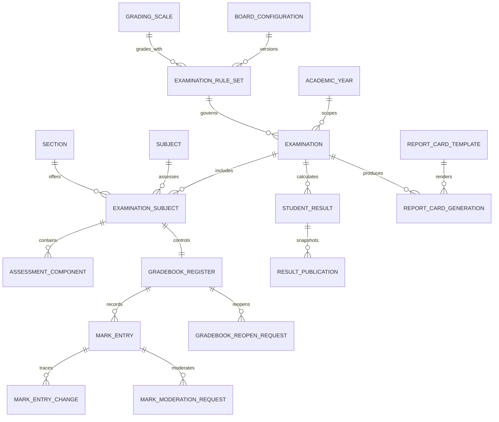

# Examinations, Gradebook, and Report Cards

## Scope and boundaries

The examinations module is a school, campus, and academic-year-scoped bounded context. It owns assessment configuration, marks registers, moderation, result calculation, immutable publication snapshots, and report-card generation requests. It does not own subject catalogues, enrolment, teaching assignments, attendance registers, or document storage; it references those authoritative modules.

Board behavior is data, not code. `ExaminationRuleSet` binds a versioned `BoardConfiguration` to a versioned `GradingScale` and stores calculation policy as validated JSON. The same engine therefore supports CBSE, CISCE/ICSE/ISC, Maharashtra State Board, another State Board, or a school-defined scheme without branching on a board name.

## Relationship overview

## Configuration and calculation

An assessment component declares a configurable kind (`INTERNAL_ASSESSMENT`, `PROJECT`, `PRACTICAL`, `VIVA`, `THEORY`, `CO_SCHOLASTIC`, or `CUSTOM`), maximum marks, optional passing marks, percentage weight, ordering, and whether it is co-scholastic. Names and subject mappings are school data and are never constants.

The current rule contract controls exempt handling, co-scholastic percentage inclusion, equal-subject versus total-marks aggregation, component-pass requirements, and output precision. Calculation uses scaled `bigint` arithmetic in the domain layer and PostgreSQL `numeric` persistence. JavaScript floating-point arithmetic is not used for official totals, weightages, percentages, or grade-boundary comparison. Database checks and a trigger independently reject invalid marks and cross-subject components.

Calculation writes a reproducible snapshot containing the rule version and subject/component inputs. A result becomes student/guardian-visible only after an actor with `assessments.results.publish` creates an append-only `ResultPublication`. Each publication has an ordered version, canonical SHA-256 snapshot hash, publisher, and time. Later post-lock changes supersede the live result but never mutate the prior publication.

## Workflow and separation of duties

The register state machine is `ENTRY -> APPROVED -> LOCKED`. A locked register can move to `REOPENED` only through a recorded request approved by a different user, after which it must be approved and locked again. Every changed mark creates `MarkEntryChange`; changes after reopening carry `postLockChange=true` and a mandatory reason. Moderation likewise requires a requester and a different approver.

Teacher access is the intersection of a scoped permission and an effective section/subject assignment. `assessments.assignments.override` is a distinct administrative capability. Marks entry, approval, moderation, locking, reopen request, reopen approval, calculation, publication, template management, and generation use separate stable permissions.

## Report cards

`ReportCardTemplate` is versioned and contains configuration for scholastic/co-scholastic sections, attendance, remarks, promotion status, grade legends, and tenant branding. Preview creates a privileged preview snapshot but does not publish the result. Individual and bulk generation only accept published results.

`ReportCardGeneration` is a durable job request with its own snapshot and opaque verification code. The initial PDF adapter queues work locally and includes a QR-verification placeholder; it deliberately does not claim a rendered PDF or expose a public verification endpoint. A future worker can render PDF bytes to private object storage without changing the application-service contract.

## Isolation, retention, and observability

Every examination table carries `trust_id`; operational tables also carry school, campus, and academic-year scope where applicable. Composite foreign keys prevent cross-scope links, services apply verified scope explicitly, and forced PostgreSQL RLS provides a final trust boundary. Mark changes and publication rows are append-only at the database layer. Examination history, marks, snapshots, templates used by history, and report evidence are archived or superseded rather than hard-deleted.

Audit events cover mark entry, moderation, register transitions, reopening, calculation, publication, preview, generation, and post-lock changes. Metadata contains safe identifiers and counts, never marks, remarks, student health information, or personal identifiers.

## Explicit limitations

- PDF rendering, signing, storage, delivery, and live QR verification remain adapter/worker responsibilities.
- Attendance summaries are read from available attendance records; timetable-driven attendance policy is not duplicated here.
- CISCE and other State Board behavior uses the generic versioned rule contract. A school must create and approve its precise board rules before operational use.
- Promotion is a recorded recommendation only; it does not mutate enrolment history.
