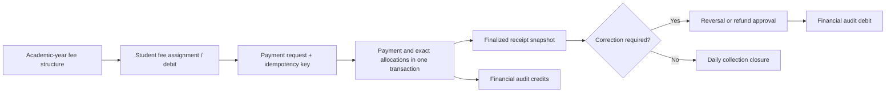

# School Fee Management Architecture

## Monetary model

All persisted amounts are integer minor units (paise) with `currency = INR`. Input accepts a decimal string with at most two fractional digits and converts it without floating-point arithmetic. Aggregation checks JavaScript safe-integer bounds. Formatting occurs only at the UI boundary with the `en-IN` locale.

## Posting and correction lifecycle

Finalized receipts, allocations, financial audit entries, and closures are database-enforced append-only records. A correction creates a payment reversal, credit note, or refund; it never edits receipt history. Receipt numbers use an academic-year-scoped sequence updated inside the posting transaction.

## Tenant isolation and indexes

Every financial table carries `trust_id`; school/campus/year fields further refine the scope. Composite foreign keys prevent cross-trust and cross-school links. Row-level security requires transaction-local `app.current_trust_id`, and application queries also include verified scope explicitly.

High-use indexes cover student/year ledgers, due-date outstanding reports, campus/date/method collection reports, adjustment/refund queues, gateway event identity, receipt lookup, and financial audit resource/date access. Unique indexes enforce payment idempotency, provider-event idempotency, receipt numbering, one payment receipt, and one daily closure per campus/date.

## Provider boundary

`PaymentProviderAdapter` exposes an opaque payment reference contract. `LocalSimulatedPaymentProvider` supports development without credentials or network calls. Card and online methods ignore user-supplied instrument data and persist only adapter-generated opaque references; PAN, CVV, expiry, and cardholder authentication values are outside the platform boundary.

Provider events use `(trust, school, provider, providerEventId)` as an idempotency boundary and store only a payload hash plus normalized event metadata. A reused event identifier with a different hash is rejected.

## Retention and archival

Fee configuration can be archived after it is superseded, while existing year/student assignments keep historical links. Payments, receipts, allocations, reversals, refunds, audit entries, and closure snapshots are retained under the institution's approved finance retention schedule. Legal retention duration remains a deployment policy decision; ordinary product workflows never hard-delete these records.
